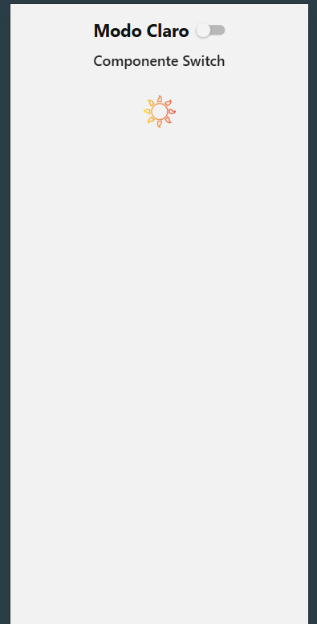

Leia-me — Atividade com Componente Switch
React Native | Capítulo 6
Objetivo

## Imagem da atividade

Desenvolver um aplicativo simples utilizando os componentes View, Text, Image e Switch, permitindo alternar entre modo claro e modo noturno.
Comportamento esperado
Quando o Switch estiver desligado, o aplicativo deve apresentar um layout claro com texto e imagem correspondentes ao modo claro. Quando o Switch estiver ligado, os mesmos elementos devem mudar para o modo noturno, alterando cores, disposição visual e a imagem exibida.
Componentes utilizados
View, Text, Image e Switch.
Observação técnica
O componente Switch já faz parte do React Native, portanto não é necessário instalar uma dependência externa para utilizá-lo nesta atividade.
Organização sugerida
O projeto pode ser estruturado com App.js, pasta de imagens e arquivo estilos.js para separar a lógica visual do componente principal.
Referência do conteúdo
Link de referência informado na conversa: https://sites.google.com/view/desenvolvimento-mobile-lfc/inicio/componentes-ui/switch
Resumo
Esta atividade tem finalidade acadêmica e demonstra o uso do componente Switch para controlar um estado binário, modificando a aparência geral da interface de forma dinâmica.
