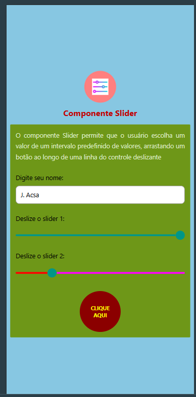

# Leia-me — Atividade com Componente Slider

Este projeto foi desenvolvido como atividade prática de **Desenvolvimento Mobile** utilizando **React Native**.

## Objetivo

Construir uma interface simples utilizando o componente **Slider**, permitindo interação do usuário com valores em um intervalo definido, além de alterar propriedades visuais da tela com base nos movimentos dos controles deslizantes.

## Imagem da atividade



Construir uma interface simples utilizando o componente **Slider**, permitindo interação do usuário com valores em um intervalo definido, além de alterar propriedades visuais da tela com base nos movimentos dos controles deslizantes.

## Funcionalidades da atividade

- Exibição de texto explicativo sobre o componente Slider
- Campo para digitar o nome do usuário
- Dois controles deslizantes (`Slider`)
- Alteração dinâmica de cores na interface
- Botão de ação com destaque visual
- Rodapé com identificação

## Instalação do componente Slider

O componente Slider não faz parte do pacote principal do React Native.  
Por isso, é necessário instalar a dependência abaixo:

```bash
npm install @react-native-community/slider@5.2.0
```

## Fonte do exercício

O exercício foi baseado no conteúdo disponível no link abaixo:

```text
https://sites.google.com/view/desenvolvimento-mobile-lfc/inicio/componentes-ui/slider
```

## Observação

Este projeto foi criado com finalidade acadêmica, como prática dos conceitos estudados em aula sobre componentes de interface no React Native.
